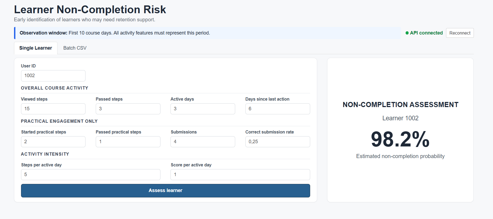
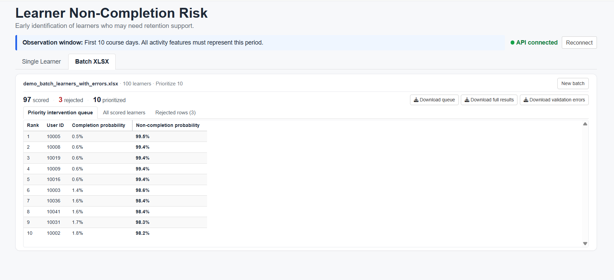

# Stepik Product Analytics & Completion Risk ML

End-to-end data science project for **early detection of course non-completion risk** using learner activity data from Stepik.

The project combines product analytics, behavioral segmentation, machine learning, reusable inference, REST API deployment, an interactive Shiny application, and automated testing in a reproducible R workflow.

## Project Goal

The main objective is to identify learners with an elevated risk of not completing a course based on their behavior during the **first 10 course days**.

The predicted non-completion probability can then be used to rank learners and prioritize retention interventions according to available support capacity.

## Project Workflow

The project covers the full data science lifecycle:

1. **Exploratory and product analytics**

   * learner activity analysis;
   * activation-gap analysis;
   * behavioral patterns related to course completion.

2. **Learner segmentation**

   * feature engineering from LMS events;
   * K-Means clustering;
   * interpretation of learner behavior profiles.

3. **Completion risk modeling**

   * Random Forest;
   * XGBoost;
   * cross-validation and model evaluation;
   * PR-AUC and F2-score analysis;
   * robustness and calibration checks.

4. **Production inference**

   * reusable prediction functions;
   * serialized model artifact;
   * single-learner prediction;
   * batch prediction;
   * input validation.

5. **Retention prioritization**

   * ranking learners by predicted non-completion probability;
   * Top-N prioritization;
   * capacity-based retention queue.

6. **Deployment and quality assurance**

   * REST API with Plumber;
   * interactive Shiny application;
   * unit and integration tests;
   * GitHub Actions CI;
   * reproducible environment with `renv`.

## Tech Stack

**Language**

* R

**Data & Analytics**

* data.table
* dplyr
* tidyr
* lubridate
* ggplot2
* corrplot
* cluster
* mclust
* fpc

**Machine Learning**

* caret
* randomForest
* xgboost
* pROC
* PRROC

**Application & Data Exchange**

* plumber
* Shiny
* readxl
* writexl

**Reproducibility & Testing**

* renv
* testthat
* GitHub Actions

## Repository Structure

```text
.
├── .github/
│   └── workflows/
│       └── r-tests.yml
│
├── R/
│   ├── batch_scoring.R
│   ├── build_retention_queue.R
│   ├── load_artifact.R
│   ├── predict_completion_risk.R
│   └── validate_prediction_input.R
│
├── api/
│   └── plumber.R
│
├── artifacts/
│   └── completion_risk_artifact.rds
│
├── data/
│   ├── demo_batch_learners.xlsx
│   └── demo_batch_learners_with_errors.xlsx
│
├── docs/
│   ├── images/
│   │   ├── .gitkeep
│   │   ├── shiny_batch.png
│   │   └── shiny_single.png
│   └── PROJECT_DOCUMENTATION.md
│
├── notebooks/
│   ├── 01_product_analysis_activation_gap.ipynb
│   ├── 02_behavioral_segmentation.ipynb
│   └── 03_completion_risk_modeling.ipynb
│
├── outputs/
│   ├── completion_risk_predictions.xlsx
│   └── retention_queue.xlsx
│
├── renv/
│   ├── .gitignore
│   ├── activate.R
│   └── settings.json
│
├── scripts/
│   ├── generate_demo_batch.R
│   ├── generate_demo_batch_with_errors.R
│   ├── run_api.R
│   └── run_batch_scoring.R
│
├── shiny/
│   └── app.R
│
├── tests/
│   └── testthat/
│       ├── setup.R
│       ├── test-api-batch-integration.R
│       ├── test-api-integration.R
│       ├── test-batch-scoring.R
│       ├── test-build-retention-queue.R
│       ├── test-predict-completion-risk.R
│       └── test-validate-prediction-input.R
│
├── .Rprofile
├── .gitignore
├── LICENSE
├── README.md
└── renv.lock
```

The repository contains small demo datasets for testing the batch prediction workflow. Larger source datasets and reproducible intermediate data are not stored in Git.

## Analytical Notebooks

The analytical workflow is documented in three Jupyter notebooks:

```text
notebooks/01_product_analysis_activation_gap.ipynb
notebooks/02_behavioral_segmentation.ipynb
notebooks/03_completion_risk_modeling.ipynb
```

They cover product analytics, behavioral segmentation, feature engineering, model development, validation, and final model selection.

The trained model is stored separately as a reusable artifact, so the modeling notebook does not need to be rerun for normal inference.

## Model Artifact

The production inference pipeline uses:

```text
artifacts/completion_risk_artifact.rds
```

The artifact contains the trained XGBoost model together with the metadata and inference configuration required to reproduce prediction behavior without retraining.

## Application

The project includes a Shiny application connected to a local Plumber REST API.

It supports:

* **Single Learner** assessment;
* **Batch XLSX** assessment;
* input validation;
* separation of invalid records;
* completion probability;
* non-completion probability;
* learner risk ranking;
* Top-N retention prioritization;
* XLSX result downloads.

## Application Preview

### Single Learner



### Batch XLSX



## Environment Setup

### 1. Clone the repository

**PowerShell / Terminal:**

```bash
git clone https://github.com/Safonovanastya87/stepik-product-analytics-completion-risk-ml.git
cd stepik-product-analytics-completion-risk-ml
```

### 2. Install R

The project was developed with **R 4.6.1**.

Using the same R version is recommended for maximum reproducibility.

### 3. Install `renv`

**R console:**

```r
install.packages("renv")
```

### 4. Restore the project environment

**R console:**

```r
renv::restore()
```

This installs the package versions recorded in `renv.lock`.

### Windows Note

Some R packages may require compilation from source when a compatible Windows binary is unavailable.

In that case, install the appropriate Rtools version for your R installation and run again:

**R console:**

```r
renv::restore()
```

## Run the Application

The Plumber API and Shiny application run as two separate processes.

### 1. Start the REST API

**R console:**

```r
source("renv/activate.R")
source("scripts/run_api.R")
```

The API runs at:

```text
http://127.0.0.1:8001
```

Swagger documentation is available at:

```text
http://127.0.0.1:8001/__docs__/
```

Keep this R console running.

### 2. Start the Shiny Application

Open a second R console.

**R console:**

```r
source("renv/activate.R")
shiny::runApp("shiny", launch.browser = TRUE)
```

The Shiny application communicates with the running Plumber API.

## Demo Batch Files

Two ready-to-use XLSX files are included:

```text
data/demo_batch_learners.xlsx
data/demo_batch_learners_with_errors.xlsx
```

`demo_batch_learners.xlsx` contains valid learner observations for demonstrating the normal batch-scoring workflow.

`demo_batch_learners_with_errors.xlsx` contains intentionally invalid rows for demonstrating validation, rejected-row handling, and partial scoring of valid learners.

## Batch XLSX Format

Each row represents one learner observed during the first 10 course days.

The input workbook must contain the following columns:

```text
user_id
n_passed_all
n_viewed_all
n_started_practical
n_passed_practical
n_submissions
submission_correct_rate
active_days
days_since_last_action
score_per_active_day
steps_per_active_day
```

Detailed validation rules are documented in:

```text
R/validate_prediction_input.R
```

## Prediction Output

For each valid learner, the inference pipeline produces:

```text
completion_probability
completion_risk
```

where:

```text
completion_risk = 1 - completion_probability
```

Learners are ranked by descending non-completion probability.

The priority queue uses the following structure:

```text
risk_rank
user_id
completion_probability
completion_risk
```

The number of learners selected for intervention is controlled by the available Top-N capacity rather than by an arbitrary fixed risk threshold.

## File-Based Batch Scoring

Batch inference can also be run directly without the Shiny interface.

The workflow is implemented in:

```text
R/batch_scoring.R
scripts/run_batch_scoring.R
```

It reads learner data from XLSX, generates predictions, builds the retention queue, and writes the results back to XLSX.

## Tests

Run the complete automated test suite from the project root.

**R console:**

```r
testthat::test_dir("tests/testthat")
```

The tests cover:

* prediction input validation;
* feature range validation;
* cross-field validation;
* prediction output structure;
* probability consistency;
* retention-queue ranking;
* Top-N prioritization;
* XLSX batch scoring;
* API integration;
* batch API integration.

The test suite is also executed automatically through GitHub Actions.

## Reproducibility

The project uses `renv` to preserve the R package environment.

A clean environment can be restored with:

**R console:**

```r
install.packages("renv")
renv::restore()
```

The package versions required for analytics, modeling, testing, API deployment, Shiny, and XLSX processing are recorded in `renv.lock`.

## Documentation

Detailed analytical and technical documentation is available in:

[`docs/PROJECT_DOCUMENTATION.md`](docs/PROJECT_DOCUMENTATION.md)

It covers:

* analytical methodology;
* activation-gap analysis;
* behavioral segmentation;
* model development and validation;
* inference architecture;
* API design;
* Shiny workflow;
* retention prioritization;
* testing;
* limitations and business interpretation.

## License

This project is licensed under the MIT License.
